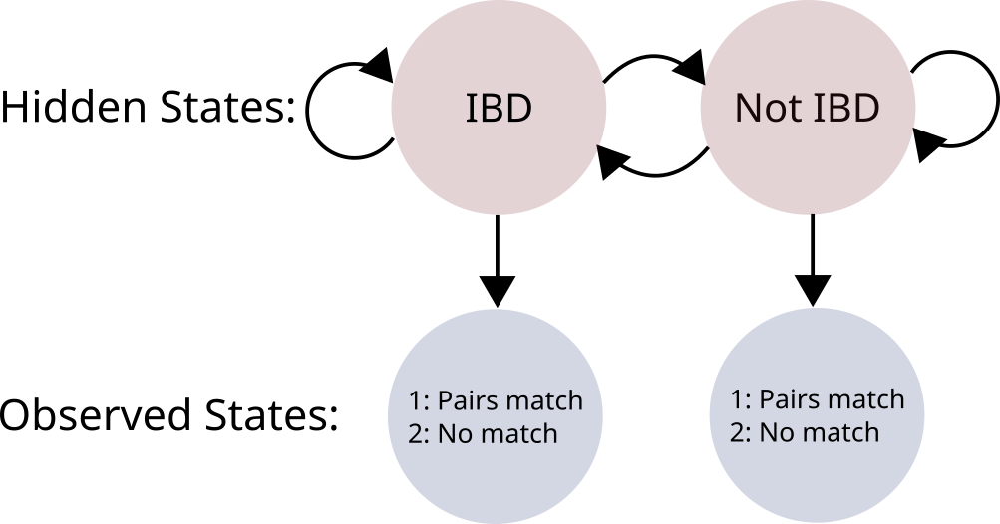
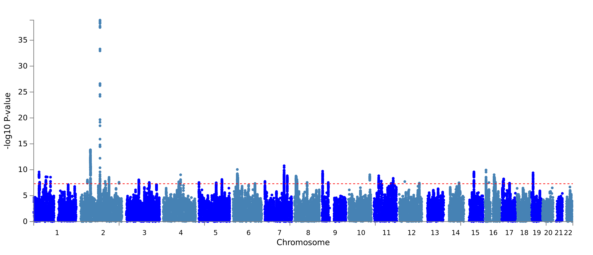
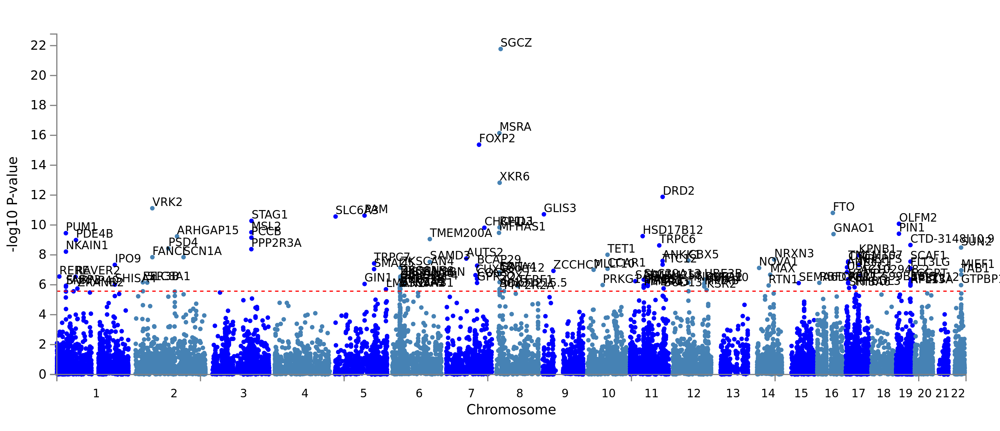
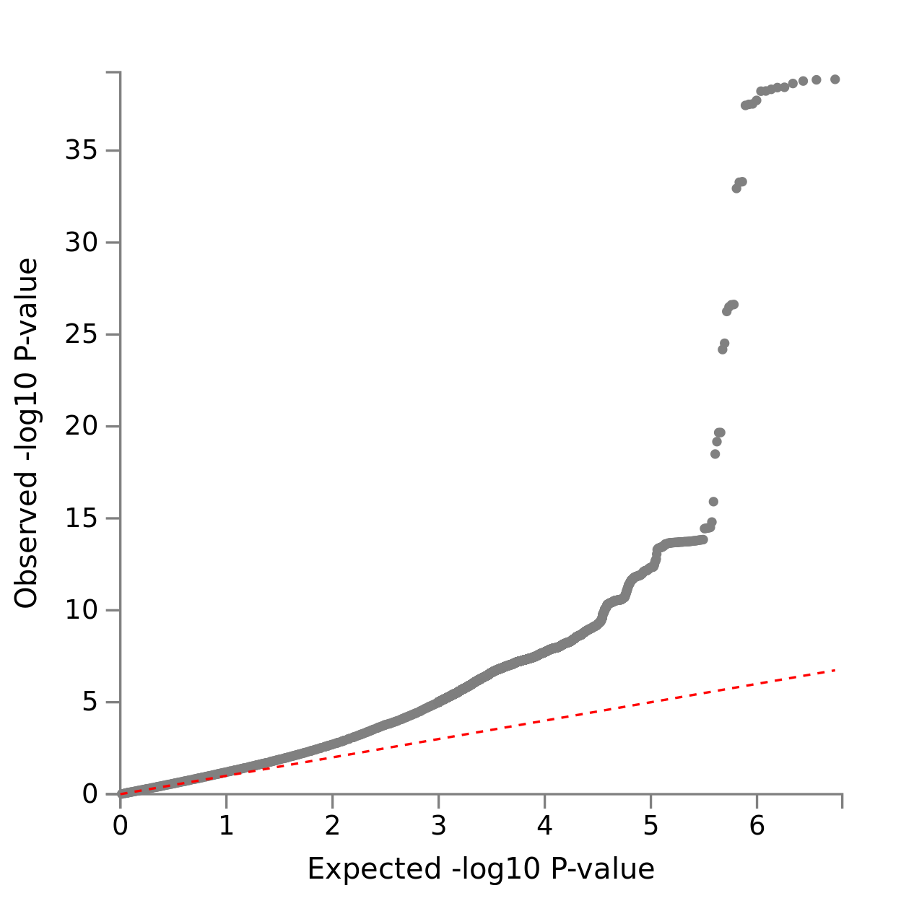
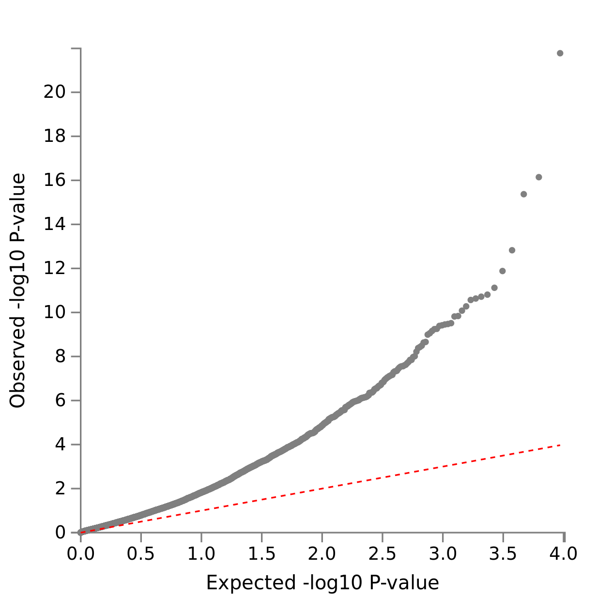
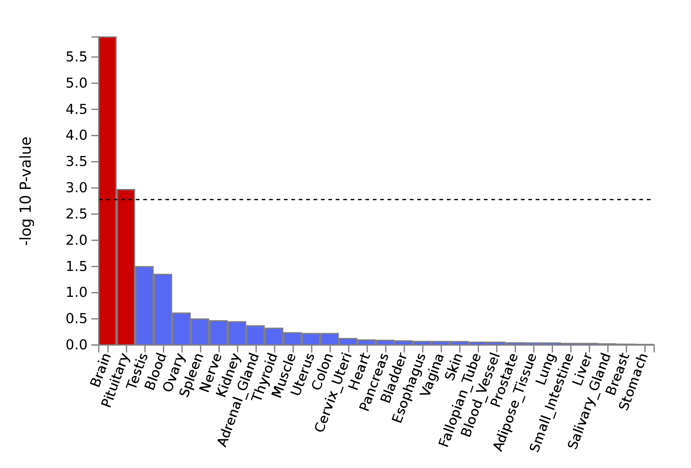
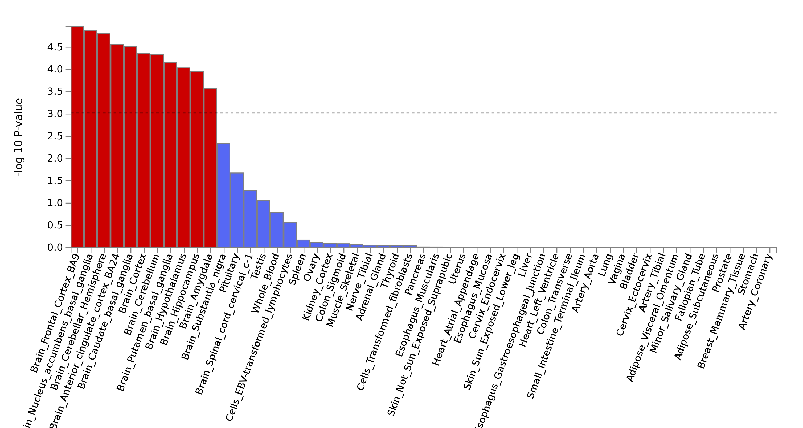

*FYI, I don't know how to control where the figures get rendered when compiling
the document from the Rmd file. The seemingly arbitrary organization of the
figures here is not by design.*

# Problem 1

*Consider a scenario in which genotypes are observed for pairs of siblings who
are second cousins. Each pair of siblings will have long chromosomal segments
that are inherited from their shared great grandparent (tracts that are
identical by descent, IBD). Suppose we would like to design a Hidden Markov
Model that could be used to infer the location of IBD tracts.*

a) *Sketch the model, defining your hidden and observed random variables.*

(See Figure 1)



Hidden variables:

 * Z: state of sequence (pairs are IBD or not IBD)

Observed variables:

 * X: genotype sequence pairs at a locus (whether they match or not)

Other variables:

 * E: emission probabilities for each state
 * A: transition probabilities of moving from state and to a state


b) *Which algorithm would you use to identify the IBD segments?*

Viterbi


c) *If two markers are separated by 0.05 cM, how could that used to inform
   transition probabilities in the model?*

The expected number of crossovers between the two markers per recombination
event is .0005.

For a family tree separating second cousins, there are 6 'steps' between the
individuals, meaning that there are 6 recombination opportunities at the locus.
This means the expected number of crossovers between the two is $6 * .0005 =
.003$, the expectation for a binomial distribution with $n=6$ and $p=.0005$.

Therefore, $P_{IBD \rightarrow IBD} = 1-.003 = .997$ and $P_{IBD \rightarrow
\overline{IBD}} = .003$ for the two markers.

When imputing entire tracts, though, one must take into account the number of
bases between the markers. 

\begin{equation}
  \frac{\textrm{No. base pairs in tract}}{.003} = \textrm{No. base pairs until 1 expected recombination event}
\end{equation}

This expectation is the expectation for the geometric distribution for whether
the sequence transition from an IBD to a non-IBD state, meaning that the
transition probability for changing state in the HMM is the reciprocal of the
expectation for distance until the first recombination event:

\begin{equation}
  \frac{.003}{\textrm{\# base pairs}}
\end{equation}

and the probability for remaining in state being 1 less that.


d) *Extra-credit: Define the emission probabilities assuming known allele
   frequencies, and assuming Hardy-Weinberg proportions.*

When comparing the genotypes $X$ of tracts that are IBD, where $X_i$ is the
genotype of individual $i$ and $X_{i,k}$ is the genotype of individual $i$ and
locus $k$ (assuming there are no mutations).

$P(X_{1,k}=X_{2,k}) = 1$

$P(X_{1,k} \neq X_{2,k}) = 0$

When comparing the genotypes $X$ of tracts that are not IBD, given $l$ alleles
$a_{l}$ at locus $k$ with frequencies $p_{a_l}$,

$P(X_{1,k}=X_{2,k}) = \sum_l p_{a_l}^2$

$P(X_{1,k} \neq X_{2,k}) = 1 - P(X_{1,k}=X_{2,k})$


# Problem 2

*Researchers often study isolated populations, e.g. Icelandic people. Typically,
a small founder population moved to a place, and then became isolated (limited
genetic flow) from the larger world. In this problem, we will explore the use
of isolated populations for studying human genetics. (Feel free to read
published work using this type of study design, e.g. papers from deCODE
Genetics.)*

a) *What are the main advantages of using isolated populations for studying
   genetics of human diseases?*

Reduced background genetic variation in isolated populations relative to global
ones improve statistical power of tests looking for disease variants that have
modest to small effect sizes.

Larger relatedness of individuals increases the likelihood of encountering rare
recessive variants, though doing a pedigree study instead would be even better
for these types of variants.

Isolated populations will also have lower heterozygosity overall because of
genetic drift.

One caveat to finding disease variants in isolated populations is that the
effect may be specific to the population and not replicate globally.


b) *Imputation is particularly effective for isolated populations. Typically
   researchers sequence a small number of individuals and then use that as a
   reference panel to impute more samples. Explain why it is easier to impute
   isolated populations.*

Imputations are more error-prone the greater the number of variants are present
in the population due to phasing problems that arise more frequently in larger,
less isolated populations due to mutation and recombination between
individuals. When all genotypes are sampled from an isolated population,
overall variation is lower, and there are fewer combinations of variants that
recombination can generate. This makes imputation easier.


c) *Unlike standard GWAS, the individuals of a population are not unrelated.
   How would you perform association analysis of a SNP?*

One would need to correct for genetic relatedness, reduced heterozygosity, etc.
A crude method of doing so is to use genomic control to generate a control
factor to scale p-values. Another is to use LD score regression instead should
the traits in question be complex. These methods could substantially reduce
power, though.

Another that will capture more variants and explain a greater proportion of
heritability of a trait is to use GCTA (or another program that employs a
mixed-effects model) to compute the pairwise relatedness of each individual and
drop those with high genetic correlation. By doing so, the SNPs can be
considered to be independent of one another and used to estimate allelic and
environmental variances used to compute heritability.


d) *Suppose we study the heritability of a complex trait. Do you expect
   heritability from isolated populations to be higher or lower or the same,
   comparing with studies using unrelated subjects?*

Heritability will be higher due to 1. shared environment (climate, diet, etc.)
reducing environmental variability relative to a population sampled globally
and 2. a greater proportion of shared common variants that drive phenotypic
variability increase the allelic variation.

\begin{align}
h^2 &= \frac{V_A}{V_P} \\
  &= \frac{V_A}{V_A+V_E}
\end{align}

Increasing allelic variance and (potentially) decreasing environmental variance
will increase (narrow-sense) heritability.


# Problem 3

*A researcher hypothesizes that longevity is influenced by genetics, and is
writing a proposal to perform a genome-wide association study of longevity. In
addition, s/he has access to a number of publicly available datasets such as
ENCODE, GTEx, and results from model organism studies of longevity (e.g.
knockout of certain genes extends the lifespan of a model species). You will
help the researcher to develop the proposal, which should address the following
questions:*

a) *A simple definition of phenotype would be the life-span of an individual.
   But the challenge is that it is generally unknown until the person dies, at
   which point it is difficult to perform any studies. Propose a study design
   that overcomes this problem.*

Impute the genotypes of dead people whose lifespans are known by using the
genotypes of their descendants and other relatives. Then, use the imputed data
to test for variants that associate with longevity.

Also, if there is already long-established genetic database in one's country
that has a field for living/deceased status available, one can simply use that
instead.


b) *Unlike many other phenotypes, the primary tissue types related to longevity
   are not well-defined. Propose a strategy to address this question using the
   results from GWAS and additional resources.*

To determine whether any tissue-specific enrichment exists, one could run a
stratified LD score regression based on functional categories of tissue types.
The regression will yield per-tissue enrichment scores for the heritability of
a trait given SNPs. Large enrichment with respect the heritability of longevity
would indicate that the tissue type is important for the longevity phenotype.


c) *How will you prioritize or follow up with the loci you find to be associated
   with longevity? You can propose any computational and experimental analysis,
   as long as it is practical.*

Experimental: Look for model organisms where the associated genes or regulatory
sequences are present. Then, run knock-out studies to see whether the effect
predicted by GWAS is recapitulated. One should also check beforehand whether
such model organism studies have already been done.

Computational: Combine data from other studies into meta-analyses that focus on
the effects sizes of the significant variants found in the initial study and
check whether or not they are replicated. This will bolster the confidence in
the SNP effect. Then, to determine a mechanistic pathway for the action of the
SNPs, one can use GTEx or ENCODE to see whether longevity-associated variants
are associated with eQTLs enriched in any tissue types.


d) *In the case that the study is underpowered, you may not find many loci.
   What strategies can you use to boost the power?*

One can use Bayesian approaches for significance testing, such as false
discovery rate FDR, to boost power at the risk of reducing sensitivity.

Also, one can impute loci for other individuals and run the association test on
the combined samples. (Greater sample size > greater power.)

Another option that may or may not improve statistical power is to combine
individuals with a similar phenotype to longevity and run the test again.

Lastly, one could use functional enrichment tools, such as FINDOR, that use
priors informed by existing knowledge to increase the power of detecting loci
associated with known variants. 


e) *One question about longevity is whether some people live very long because
   they have fewer disease variants or they have some extra protective
   variants. Propose some idea to compare the two hypotheses.*

If the longevity is caused by having fewer disease variants, the SNPs
associated with longevity will be associated with a reduced disease risk. Fewer
causal variants add up to a smaller polygenic risk score.

If instead longevity is caused by a set of protective variants, longer-lived
individuals will have similar disease risk scores for diseases based when
compared to risk scores for the general population.

To compare the two hypotheses, run GCTA to find the (polygenic) risk scores for
various diseases. If the longevity is caused by having fewer disease variants,
longer-lived individuals will have a risk distribution skewed toward lower
risk, and variants associated with longevity may show as having a negative
effect on disease phenotype. In the case that the longevity variants are
protective, the risk distribution for the longer-lived population will be the
same as that of the general one, and the variants conferring protection against
diseased phenotypes will not show up as a causal variant.


# Problem 4

*In this problem, we explore the importance of considering the power when
comparing findings across multiple studies. As discussed in the class, cis-eQTL
of different tissues are often shared. Suppose in the first tissue, we found
$n$ eQTL above our significance threshold, $p < \lambda$. In the second tissue,
$k$ out of these $n$ eQTL are statistically significant at $p < \lambda$.*

a) *Can we say that the true proportion of cis-eQTL that are shared with the
   second tissue is $k/n$? If not, why?*

No, factors such as increased variance in expression in the second tissue or
difference in study design and sequencing technologies can reduce the power of
statistical tests run on the second tissue.


b) *Assume we know that the power in the eQTL study of the second tissue is
   $\beta$, at $p$-value threshold $\lambda$. Use these numbers to estimate
   how often a cis-eQTL in the first tissue is also an eQTL in the second
   tissue (Hint: some of the $n$ SNPs found in the first tissue are true eQTL
   in the second tissue, other are not. For each of these two sets of SNPs,
   what is the probability that a SNP has $p$-value below $\lambda$ in the
   second tissue?).*

If the eQTL is true in the second tissue, then the probability of it being
detected by the study is $\beta$ - the statistical power. If not, then it will
be called incorrectly as an eQTL with probability $\lambda$.

$\pi$ is the proportion of eQTLs shared between tissues 1 and 2.

$n (1 - \pi)$ is the proportion of calls from tissue 1 that are not shared.

$n \pi$ is the proportion of calls from tissue 1 that are shared.

Given $k$, the number of calls shared between the tissue types:

\begin{align}
  k &= n (1 - \pi) \lambda + n \pi \beta \\
  \frac{k}{n} &= \lambda + \pi ( \beta - \lambda ) \\
  \implies  \pi &= \frac{\frac{k}{n} - \lambda}{\beta - \lambda}
\end{align}

Note here that $\beta$ here refers to the statistical power and not the chance
for type II error, its common definition.


# Problem 5

*Let's analyze real GWAS results and write a summary. Pick a phenotype from UK
Biobank here
(\url{https://docs.google.com/spreadsheets/d/1b3oGI2lUt57BcuHttWaZotQcI0-
mBRPyZihz87Ms_No/edit?usp=sharing}) and download the GWAS summary statistics.
Upload summary results to FUMA (\url{http://fuma.ctglab.nl/}; you need to
create an account). Write a report on your findings with the sections (one
paragraph each) listed below using this as a guide:
\url{http://journals.plos.org/ploscompbiol/article?id=10.1371/journal.pcbi.1005619}.*

Phenotype: Sleep duration  
UK Biobank code: 1160

The following commands download and process the data to be uploaded to FUMA and
used for S-PrediXcan.

```{bash,eval=F}
wget -nc https://www.dropbox.com/s/uwpewpzevn9vba6/1160.assoc.tsv.gz
gunzip -d 1160.assoc.tsv.gz
```

```{r, eval=F}
library(dplyr)
library(tidyr)

infile <- "1160.assoc.tsv"
editfile <- paste("edit_", infile, sep='')

# Split the variant column into separate fields for chromosome number,
# position, effect, and non-effect alleles.
df <- read_tsv(infile)
df <- df %>% separate(variant, c('chr','pos', 'a2', 'a1'), sep=':')
write_tsv(df, editfile)
```

```{bash,eval=F}
gzip edit_1160.assoc.tsv
```

The script for running the S-PrediXcan analysis is as follows:

```{bash, eval=F}
# Download the tissue and covariance data
wget -nc https://s3.amazonaws.com/predictdb2/download-by-tissue/Brain_Frontal_Cortex_BA9.tar.gz
tar xf Brain_Frontal_Cortex_BA9.tar.gz
mv Brain_Frontal_Cortex_BA9 data
mkdir -p data/GWAS
cp edit_1160.tsv.gz data/GWAS # from data cleanup earlier
```

```{bash,eval=F}
# (for midway2 cluster)
module load python/2.7.12

# Run S-PrediXcan
./MetaXcan.py \
  --model_db_path data/gtex_v7_Brain_Frontal_Cortex_BA9_imputed_europeans_tw_0.5_signif.db \
  --covariance data/gtex_v7_Brain_Frontal_Cortex_BA9_imputed_eur_covariances.txt.gz \
  --gwas_folder data/GWAS \
  --gwas_file_pattern ".*gz" \
  --snp_column rsid \
  --effect_allele_column a1 \
  --non_effect_allele_column a2 \
  --beta_column beta \
  --pvalue_column pval \
  --output_file results/1160.csv
```


a) *Abstract*

Virtually everyone needs sleep, but there is variation both the duration people
sleep and the duration of sleep people need. Many factors, such as occupation,
income, culture, national policies, etc., drive this variation, but there
remains the question of the extent of the genetic component. The heritability
of the trait has implications on a personal level of optimizing ones routines
and on a national level in terms of putting forward effective health policies.
A GWAS of 335,410 individuals (white, British) from the UK Biobank reveals
several causal variants associated with duration of sleep, and functional
analysis of gene sets from MAGMA and imputed expression levels from S-PrediXcan
suggests sleep duration is affected in part by variation in genes such as
FADS1, POMC, and MXD3, which are associated with fatty acid production, stress
response, and neural development, respectively.


b) *Introduction: Explain why you picked this phenotype and why it may be
   important.*

Duration of sleep is a factor that all people must contend with in day-to-day
life, and it is something that many try to optimize in one manner or another.
On an individual level, it affects quality of life and long-term mental and
physical health, and on a macroeconomic scale, it has profound downstream
implications on national health costs, labor productivity, and other factors.
Many national health resources and public organizations, such as the CDC [1],
have published guidelines for how many hours of sleep people need, but one
confounding variable that affects the universality of guidelines is genetics.
Some people may simply need more or less sleep than others, and understanding
the extend of this will help improve existing health guidelines, assist
physicians and therapists in understanding the variation in effect sleep
deprivation can have on people, and perhaps most importantly help people
themselves in understanding their own possibly idiosyncratic requirements.


c) *Results: Include plots from the genome-wide plots tab from FUMA with your
   interpretation. Gene set analysis may sometimes provide you with interesting
   stories to tell.*

A GWAS of sleep duration reveals many significant variants across many
chromosomes (Figure 2), many of which are located inside genes themselves
(Figure 3). This could be due to cryptic population substructure in the sampled
white British population that leads to elevated p-values (see q-q plots in
Figures 4 and 5), or it could reflect real and substantial polygenicity in the
trait itself. Under the latter assumption, a MAGMA analysis using the GTEx (v6)
gene ontology database shows that the SNPs show enrichment in gene sets
relating to regulation of synapse structure and synaptic plasticity, and they
show functional enrichment in brain tissue (Figure 6), specifically those
relating to the frontal cortex and basal ganglia (Figure 7).  These results
suggest that the genetic basis for variation in hours slept is derived in part
from variation in expression in particular neuronal types.


| Gene Set                                    | N genes | Beta    | Beta STD | SE       | P          | P (bonf) |
| ---                                         | ---     | ---     | ---      | ---      | ---        | ---      |
| regulation of synapse structure or activity | 222     | 0.29621 | 0.032068 | 0.063514 | 1.564e-06  | 0.016692 |
| regulation of synaptic plasticity           | 136     | 0.33651 | 0.02858  | 0.078485 | 9.0802e-06 | 0.096903 |
| ene sets: blalock alzheimers disease dn     | 1155    | 0.11488 | 0.027643 | 0.027288 | 1.2841e-05 | 0.137026 |














d) *Run S-PrediXcan (https://github.com/hakyimlab/MetaXcan) using your favorite
   tissue to find gene level associations and discuss the results.*

Based on the tissue enrichment results from MAGMA, brain tissue from the
PredictDB database is used for finding gene associations
(`Brain_Frontal_Cortex_BA9`). The subset of the most significant associations
are listed in the below table. Many of the genes returned correspond to the
genes implicated in the GWAS, but some were not identified as significant based
on genotype alone. Many of the genes are pseudogenes, long non-coding RNAs, or
genes with generic functional activities (serine proteases, ATP or Na/K
transporters, etc.). Associations with known functional annotations
conceptually relevant to neural function are: FADS1 (p=0.000785), a fatty-acid
desaturase necessary for production of arachidonic acid in the brain that is
associated with hippocampus function and neuronal growth and repair; POMC
(p=0.00358), which is used to generate opioid peptides in the brain, reduce
inflammation from stress, and play other roles in the adrenocorticotropic
system; and MXD3 (p=0.000328) implicated in neural development and
transcriptional regulation.

| gene name      | zscore   | effect size | pvalue       | var g      | pred perf r2 | pred perf pval |
| ---            | ---      | ---         | ---          | ---        | ---          | ---            |
| IFITM4P        | 5.7253   | 0.02253     | 1.032271e-08 | 0.10928345 | 0.1188832    | 0.0004927      |
| RP1-265C24.5   | 4.9739   | 0.01724     | 6.560974e-07 | 0.13032516 | 0.1420948    | 0.0001636      |
| RP11-481A20.10 | 4.5418   | 0.01225     | 5.576837e-06 | 0.25736487 | 0.3731363    | 1.2052627e-11  |
| TMPRSS5        | -4.525   | -0.0122     | 6.024192e-06 | 0.22724825 | 0.4572667    | 7.1191436e-16  |
| EFCAB13        | -4.47005 | -0.0211     | 7.789742e-06 | 0.08689674 | 0.0540997    | 0.0228076      |
| HCG4           | 4.46055  | 0.01162     | 8.173548e-06 | 0.25557102 | 0.4838990    | 5.0324798e-17  |
| CTD-3110H11.1  | -4.4428  | -0.0146     | 8.878922e-06 | 0.16062345 | 0.2565119    | 8.2654456e-08  |
| NKAIN1         | 4.4347   | 0.02245     | 9.217076e-06 | 0.07892689 | 0.2042395    | 2.5873665e-06  |
| PABPC1L        | 4.4195   | 0.03260     | 9.891090e-06 | 0.03472023 | 0.0836284    | 0.0045662      |
| FADS1          | -4.3881  | -0.0242     | 1.141640e-05 | 0.06006156 | 0.1082488    | 0.0007854      |
| RP11-481A20.11 | 4.3797   | 0.02955     | 1.187965e-05 | 0.03975994 | 0.1556591    | 6.7401232e-05  |


e) *Discussion*

The study identifies several plausible variants that are implicated in neuronal
function, suggesting at the very least that there is a genetic basis with
proximal biological mechanisms for the number of hours a person sleeps. A more
ambitious interpretation is that adjusting the neuronal molecular phenotypes
inferred by genotype pharmacologically or by other mechanisms could allow one
to alter the number of hours of sleep needed for normal function. This assumes
of course that the individuals' genotypes are sampled from a population where
at least on average each person is getting his requisite amount of sleep.

However, the results should not necessarily be understood as identifying
variants that correspond to the duration of sleep people need. Other
non-genetic explanations that confound the analysis exist, and it is also
possible that the genotypes correspond to alternative phenotypes. For example,
if instead the genotype confers a phenotype of variation in the duration of
sleep needed or specifies a range of needed sleep duration, combined with
strictures on possible number of hours of sleep imposed by occupation or
lifestyle, could give rise to the causal interpretation the GWAS assumes.


**References**

1. CDC - How Much Sleep Do I Need? - Sleep and Sleep Disorders. Available at:
   https://www.cdc.gov/sleep/about_sleep/how_much_sleep.html. (Accessed: 20th
   March 2019)
